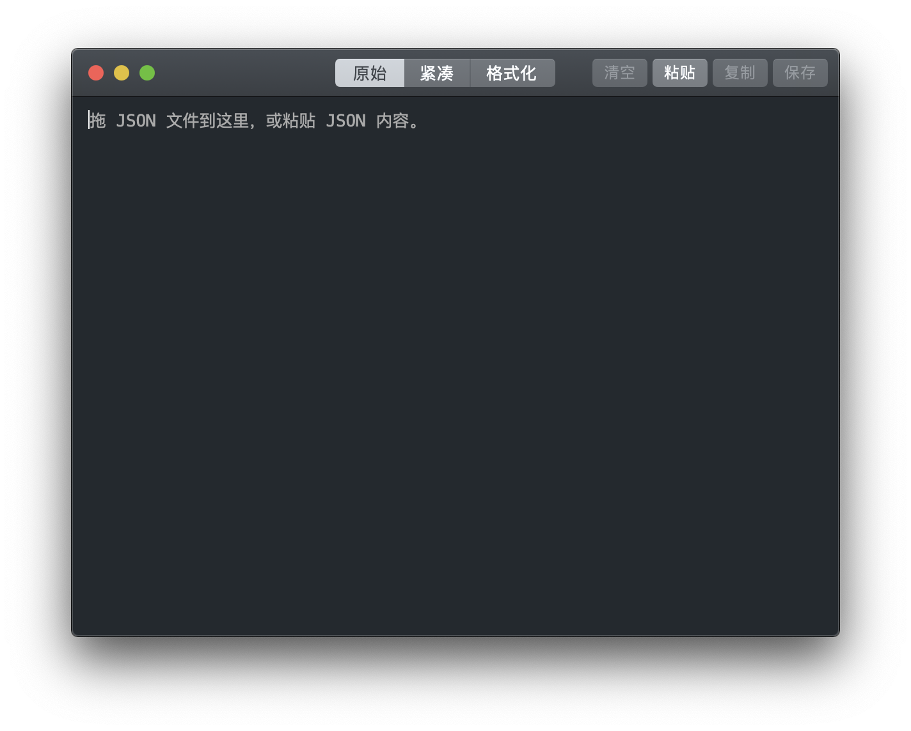

# DirtyJSONMacOSAppDemo

A simple macOS demo app showcasing the usage of the [DirtyJSONSwift](https://github.com/wuyu2015/DirtyJSONSwift) and [StupidNSWindow 包的使用方法](https://github.com/wuyu2015/StupidNSWindow) packages.

一个简单的 macOS 演示应用程序，展示了 [DirtyJSONSwift](https://github.com/wuyu2015/DirtyJSONSwift) 和 [StupidNSWindow 包的使用方法](https://github.com/wuyu2015/StupidNSWindow)。

